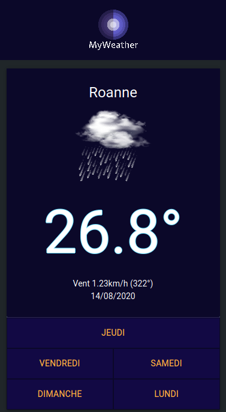

# [tp-weather](https://pozorfluo.github.io/tp-weather/index.html)

vanilla typescript web components with KOПЯΛD  

## todo

- Try moving non-UI stuff to a web worker
- Extract komrad, app-solo updates
